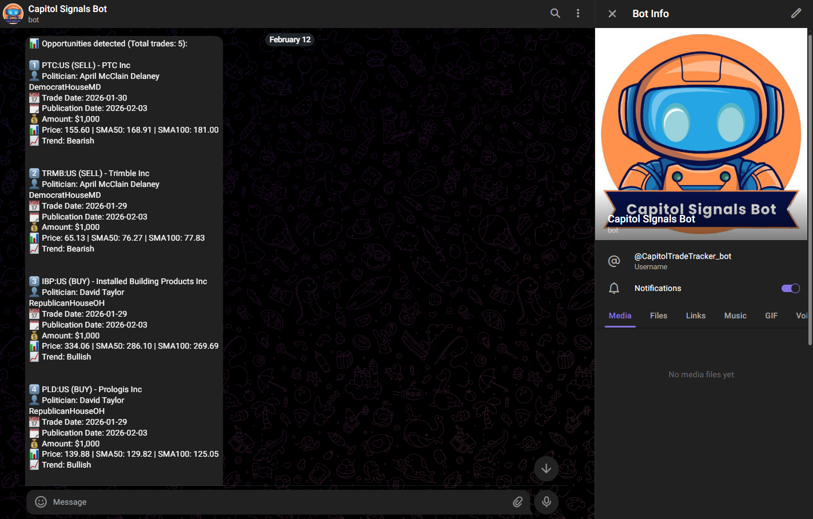

#  — Daily politician stock telegram alerts

<sub>🗓️ Developed in August 2025</sub>  

This project scrapes **US politicians' stock trades** from [CapitolTrades](https://www.capitoltrades.com), analyzes the price trend of the traded companies using **moving averages**, and sends a **daily alert on Telegram** with the most relevant opportunities.

---

## ✅ Features
- Scrapes the latest trades from **CapitolTrades** using **Selenium**.
- Filters trades based on:
  - Minimum amount (`$1,000` by default).
  - Last `15 days` of activity.
- Retrieves **price trend** using **Yahoo Finance**:
  - Calculates **SMA50** and **SMA100**.
  - Classifies as **Bullish**, **Bearish**, or **Neutral** trends.
- Sends a **Telegram alert** with:
  - Company & Ticker.
  - Politician name.
  - Trade date & publication date.
  - Trade type (buy/sell).
  - Trend analysis.

---

## 🛠 Installation & Setup (Local)

### 0. Prerequisites
- **Python 3.11 – 3.13** (Python 3.14 is not yet supported by some dependencies)
- **Google Chrome** installed (Selenium uses it; ChromeDriver is downloaded automatically)
- A Telegram bot token and chat ID

### 1. Clone the repository
```bash
git clone https://github.com/marcturu/capitol-signals-bot.git
cd capitol-signals-bot
```

### 2. Create a virtual environment and install dependencies
```bash
python -m venv .venv

# Windows (CMD/PowerShell)
.venv\Scripts\activate
# Windows (Git Bash) / macOS / Linux
source .venv/Scripts/activate   # Git Bash
source .venv/bin/activate       # macOS / Linux

pip install --upgrade pip
pip install -r requirements.txt
```

### 3. Configure the environment variables
Create your local `.env` file from the provided example:

```bash
cp .env.example .env
```

On Windows, you can also simply copy `.env.example` and rename the copy to `.env`.

Then, generate a `TELEGRAM_TOKEN` via [**_@BotFather_**](https://telegram.me/BotFather) and a `TELEGRAM_CHAT_ID` via [**_@userinfobot_**](https://telegram.me/userinfobot).

### 4. Run the script manually  
```bash
python main.py
```

--- 
## ⚡ Automate with GitHub Actions (Daily Execution)

This project includes a **GitHub Actions workflow** that runs the script **every day at 09:00 CET (7:00 UTC)**.  
- Runs the script automatically in the cloud (no need to keep your PC on).
- Installs **Python**, **Google Chrome**, and **ChromeDriver**.
- Executes the script with secure credentials stored in **GitHub Secrets**.  

### 📌 Setup Steps:

1. **Push your code to your GitHub repository**.
2. Go to:  
   **Settings → Secrets and variables → Actions**  
   and add the following:
   - `TELEGRAM_TOKEN` → Your Telegram bot token.
   - `TELEGRAM_CHAT_ID` → Your Telegram chat id.
3. Make sure the workflow file exists in your repository at:

   `.github/workflows/daily.yml`

   > **Note:**  
   > Create the `.github/workflows/` folder if it doesn't exist,  
   > then add the [`daily.yml`](https://github.com/marcturu/capitol-signals-bot/blob/main/.github/workflows/daily.yml) workflow file with its content.

---

## 📷 Screenshots  

### Capitol Signals Bot (Telegram):   

-
### CapitolTrades website:  

-
### YahooFinance (META Example):

-
### Workflow Actions GitHub:
