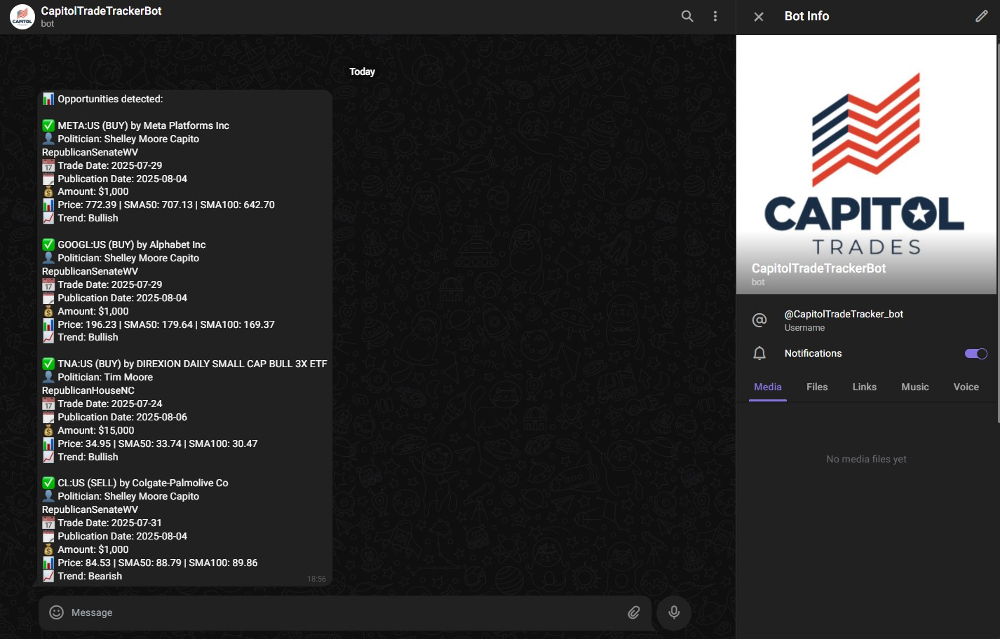
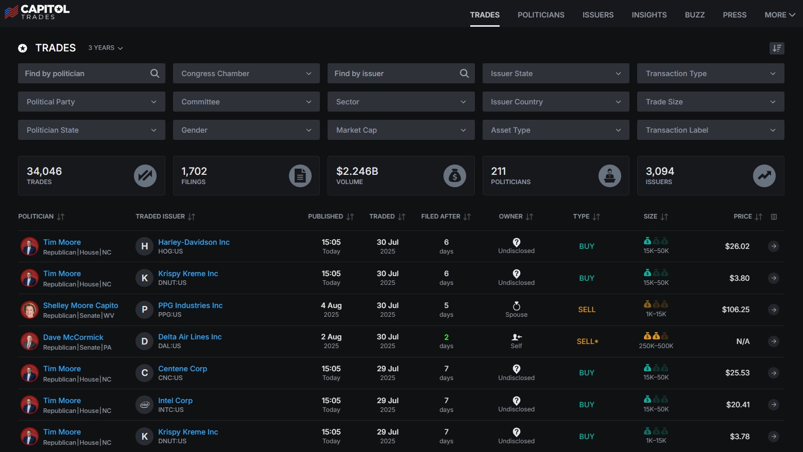
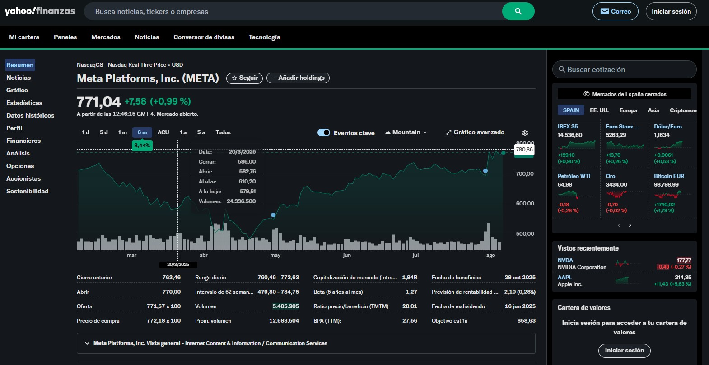
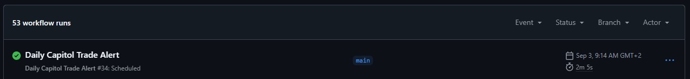

# 📈 CapitolTrades Telegram Bot

<sub>🗓️ Developed in August 2025</sup>  

This project scrapes **US politicians' stock trades** from [CapitolTrades](https://www.capitoltrades.com), analyzes the price trend of the traded companies using **moving averages**, and sends a **daily alert on Telegram** with the most relevant opportunities.

---

## ✅ Features
- Scrapes the latest trades from **CapitolTrades** using **Selenium**.
- Filters trades based on:
  - Minimum amount (`$1,000` by default).
  - Last `15 days` of activity.
- Retrieves **price trend** using **Yahoo Finance**:
  - Calculates **SMA50** and **SMA100**.
  - Classifies as **Bullish**, **Bearish**, or **Neutral** trends.
- Sends a **Telegram alert** with:
  - Company & Ticker.
  - Politician name.
  - Trade date & publication date.
  - Trade type (buy/sell).
  - Trend analysis.

---

## 🛠 Installation & Setup (Local)

### 1. Clone the repository
```bash
git clone https://github.com/marcturu/telegram-bot-capitol-trades.git
cd telegram-bot-capitol-trades
```
### 2. Install dependencies
```bash
pip install --upgrade pip
pip install -r requirements.txt
```
### 3. Set environment variables  
Create a .env file in the project root with:  
```ini
TELEGRAM_TOKEN=your_telegram_bot_token
TELEGRAM_CHAT_ID=your_chat_id
```
> **Note:**  
> Get your bot token via _BotFather_.  
> Get your chat id via _userinfobot_  
### 4. Run the script manually  
```bash
python main.py
```

--- 
## ⚡ Automate with GitHub Actions (Daily Execution)

This project includes a **GitHub Actions workflow** that runs the script **every day at 09:00 CET (7:00 UTC)**.  
- Runs the script automatically in the cloud (no need to keep your PC on).
- Installs **Python**, **Google Chrome**, and **ChromeDriver**.
- Executes the script with secure credentials stored in **GitHub Secrets**.  

### 📌 Setup Steps:

1. **Push your code to your GitHub repository**.
2. Go to:  
   **Settings → Secrets and variables → Actions**  
   and add the following:
   - `TELEGRAM_TOKEN` → Your Telegram bot token.
   - `TELEGRAM_CHAT_ID` → Your Telegram chat id.
3. Make sure the workflow file exists in your repository at:

   `.github/workflows/daily.yml`

   > **Note:**  
   > Create the `.github/workflows/` folder if it doesn't exist,  
   > then add the `daily.yml` workflow file with the content below.

```yaml
name: Daily Capitol Trade Alert

on:
  schedule:
    - cron: '0 7 * * *'
  workflow_dispatch:

jobs:
  run-script:
    runs-on: ubuntu-latest

    steps:
      - name: Checkout code
        uses: actions/checkout@v3

      - name: Set up Python
        uses: actions/setup-python@v4
        with:
          python-version: '3.11'

      - name: Install dependencies
        run: |
          python -m pip install --upgrade pip
          pip install -r requirements.txt

      - name: Install Chrome and ChromeDriver
        run: |
          sudo apt-get update

          sudo apt-get install -y wget unzip
          wget https://dl.google.com/linux/direct/google-chrome-stable_current_amd64.deb
          sudo apt install -y ./google-chrome-stable_current_amd64.deb
          # Instalar chromedriver compatible
          DRIVER_VERSION=$(wget -qO- https://chromedriver.storage.googleapis.com/LATEST_RELEASE)
          wget https://chromedriver.storage.googleapis.com/${DRIVER_VERSION}/chromedriver_linux64.zip
          unzip chromedriver_linux64.zip
          sudo mv chromedriver /usr/local/bin/
          sudo chmod +x /usr/local/bin/chromedriver

      - name: Set CHROME_BIN env
        run: echo "CHROME_BIN=$(which google-chrome)" >> $GITHUB_ENV

      - name: Run script
        env:
          TELEGRAM_TOKEN: ${{ secrets.TELEGRAM_TOKEN }}
          TELEGRAM_CHAT_ID: ${{ secrets.TELEGRAM_CHAT_ID }}
        run: |
          python main.py
```

---

## 📷 Screenshots  

### CapitolTrades Telegram Bot:   

-
### CapitolTrades website:  

-
### YahooFinance (META Example):

-
### Workflow Actions GitHub:


---

## ⚖️ Copyright & License

© 2025 Marc Turu Roca. All rights reserved.

This project and its contents are the exclusive intellectual property of Marc Turu Roca.  
All rights reserved. No part of this project may be copied, modified, distributed, or used without prior written permission from the author.  
