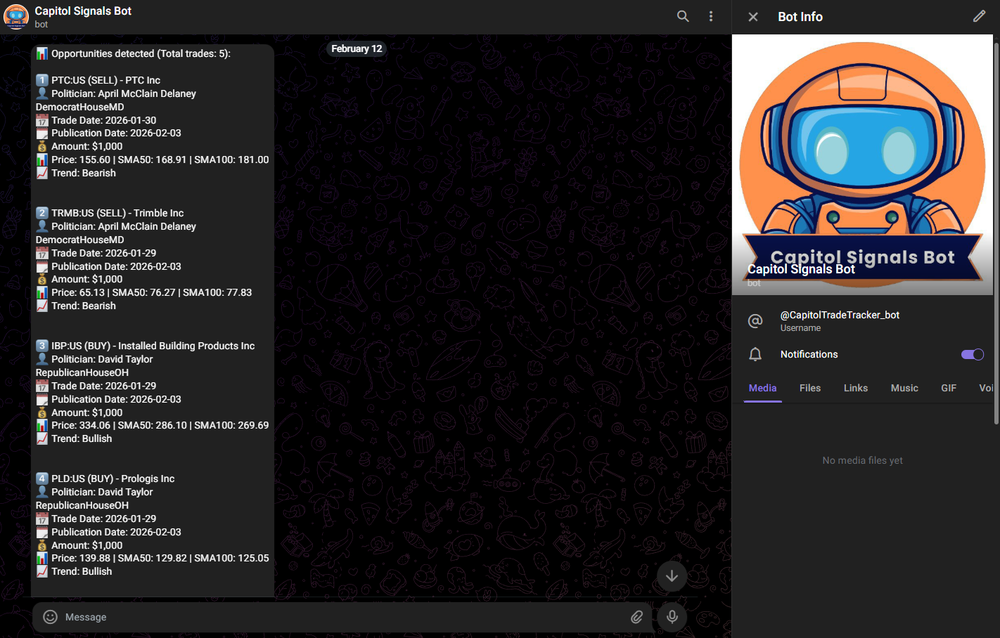
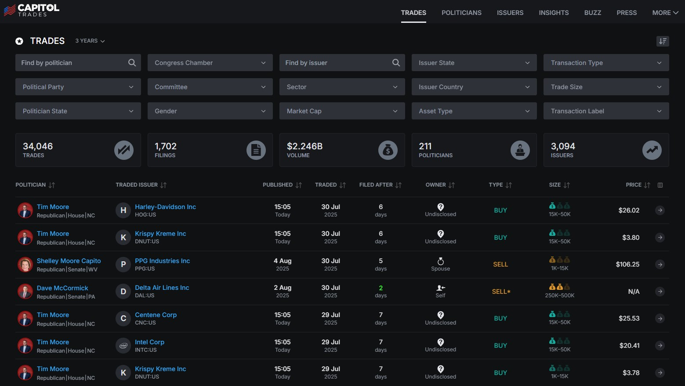
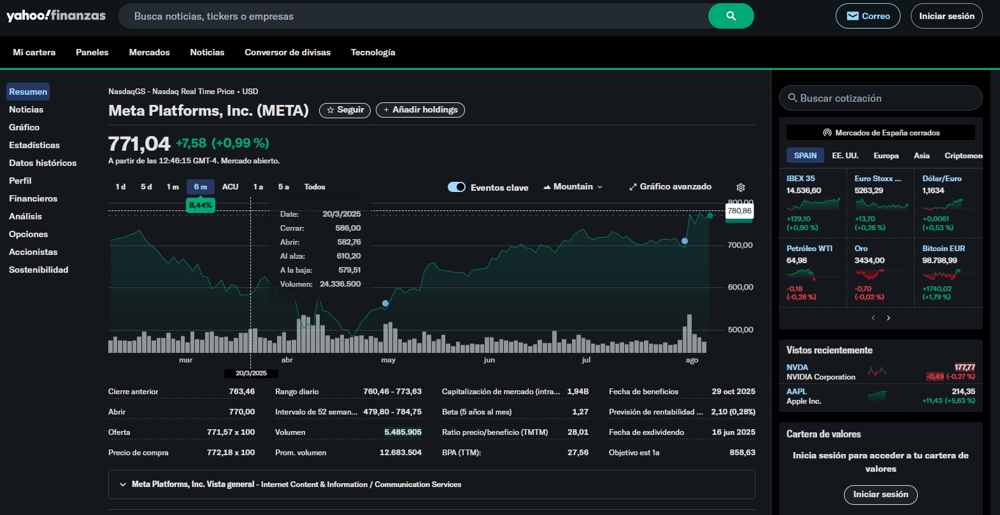
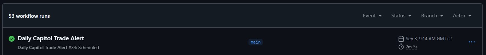

#  — Daily politician stock telegram alerts

<sub>🗓️ Developed in August 2025</sub>  

This project scrapes **US politicians' stock trades** from [CapitolTrades](https://www.capitoltrades.com), analyzes the price trend of the traded companies using **moving averages**, and sends a **daily alert on Telegram** with the most relevant opportunities.

---

## ✅ Features
- Scrapes the latest trades from **CapitolTrades** using **Selenium**.
- Filters trades based on:
  - Minimum amount (`$1,000` by default).
  - Last `15 days` of activity.
- Retrieves **price trend** using **Yahoo Finance**:
  - Calculates **SMA50** and **SMA100**.
  - Classifies as **Bullish**, **Bearish**, or **Neutral** trends.
- Sends a **Telegram alert** with:
  - Company & Ticker.
  - Politician name.
  - Trade date & publication date.
  - Trade type (buy/sell).
  - Trend analysis.

---

## 🛠 Installation & Setup (Local)

### 0. Prerequisites
- **Python 3.11 – 3.13** (Python 3.14 is not yet supported by some dependencies)
- **Google Chrome** installed (Selenium uses it; ChromeDriver is downloaded automatically)
- A Telegram bot token and chat ID

### 1. Clone the repository
```bash
git clone https://github.com/marcturu/capitol-signals-bot.git
cd capitol-signals-bot
```

### 2. Create a virtual environment and install dependencies
```bash
python -m venv .venv

# Windows (CMD/PowerShell)
.venv\Scripts\activate
# Windows (Git Bash) / macOS / Linux
source .venv/Scripts/activate   # Git Bash
source .venv/bin/activate       # macOS / Linux

pip install --upgrade pip
pip install -r requirements.txt
```

### 3. Configure the environment variables
Create your local `.env` file from the provided example:

```bash
cp .env.example .env
```

On Windows, you can also simply copy `.env.example` and rename the copy to `.env`.

Then, generate a `TELEGRAM_TOKEN` via [**_@BotFather_**](https://telegram.me/BotFather) and a `TELEGRAM_CHAT_ID` via [**_@userinfobot_**](https://telegram.me/userinfobot).

### 4. Run the script manually  
```bash
python main.py
```

--- 
## ⏰ Automate with a daily execution

> **Before you start:** complete the [Installation & Setup](#-installation--setup-local) steps above (virtual environment, dependencies and `.env` file) and check that `python main.py` works and you receive the Telegram message. The scheduled task relies on the `.venv` and `.env` files in the project folder.

CapitolTrades is protected by Vercel's anti-bot checkpoint, which blocks GitHub-hosted runners (datacenter IPs). For this reason, the recommended way to get daily alerts is to **run the script from your own machine**.

### Option 1: Local machine (recommended)

#### Windows (Task Scheduler)
1. Open **Task Scheduler** → **Create Basic Task...**
2. **Trigger:** Daily, at the time you prefer.
3. **Action:** Start a program, with:
   - **Program/script:** `"C:\path\to\capitol-signals-bot\.venv\Scripts\python.exe"`
   - **Add arguments:** `main.py`
   - **Start in:** `C:\path\to\capitol-signals-bot` (no quotes; this is where the `.env` file is read from)
4. In the task **Properties → Settings**, enable *"Run task as soon as possible after a scheduled start is missed"* so it runs even if the PC was off at the scheduled time.

#### Linux / macOS (cron)
```bash
0 9 * * * cd /path/to/capitol-signals-bot && .venv/bin/python main.py
```

### Option 2: GitHub Actions (experimental)

The repository includes a workflow at [`.github/workflows/daily.yml`](https://github.com/marcturu/capitol-signals-bot/blob/main/.github/workflows/daily.yml) that runs the script every day at 07:00 UTC and can also be launched manually from the **Actions** tab.

1. Go to **Settings → Secrets and variables → Actions → Secrets** and add:
   - `TELEGRAM_TOKEN` → Your Telegram bot token.
   - `TELEGRAM_CHAT_ID` → Your Telegram chat ID.
2. Uncomment the schedule lines in `daily.yml`:
   ```yaml
    # schedule:
    #   - cron: '0 7 * * *' 
   ```
3. Choose where it runs:
   - **GitHub-hosted runner (default, cloud):** nothing else to do.
   - **Self-hosted runner (recommended if you want it to work reliably):** set up a [self-hosted runner](https://docs.github.com/en/actions/hosting-your-own-runners) on a machine that is always on, with Google Chrome installed, then go to **Settings → Secrets and variables → Actions → Variables** and create a variable `RUNNER` with the value `self-hosted`.

> ⚠️ **Note (28/09/2026):** CapitolTrades is protected by Vercel's anti-bot checkpoint, which currently blocks GitHub-hosted runners (datacenter IPs). In that case the scraping fails and the bot sends a `⚠️ Error: no trades could be scraped` message. The debug screenshot is available in the run's artifacts.  
> For a reliable daily alert, use **Option 1** or a **self-hosted runner**.

---

## 📷 Screenshots  

### Capitol Signals Bot (Telegram):   

-
### CapitolTrades website:  

-
### YahooFinance (META Example):

-
### Workflow Actions GitHub:
